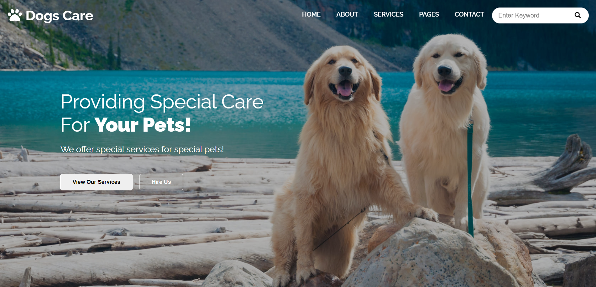
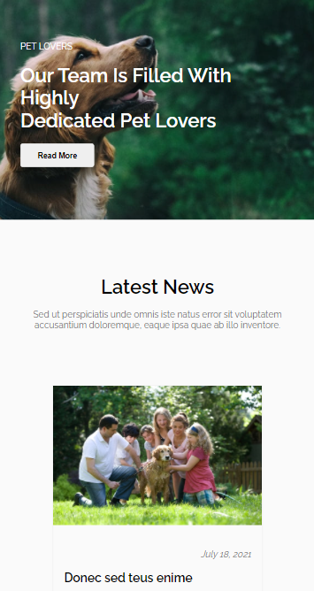

<!-- Please update value in the {}  -->

<h1 align="center">Dogs Care</h1>

   Solution for a layout from  <a href="https://w3layouts.com/" target="_blank">w3layouts</a>.

  <h3>
    <a href="https://silly-golick-1d35ef.netlify.app/" >
      Demo
    </a>
     | 
    <a href="https://github.com/prasannakarki77/Dogs-Care.git" >
      Solution
    </a>
     | 
    <a href="https://w3layouts.com/template/dogs-care-a-pet-care-wordpress-theme/" >
      Design
    </a>
  </h3>

<!-- TABLE OF CONTENTS -->

## Table of Contents

- [Overview](#overview)
  - [Built With](#built-with)
- [Contact](#contact)

<!-- OVERVIEW -->

## Overview

### Built With

<!-- This section should list any major frameworks that you built your project using. Here are a few examples.-->

- HTML
- CSS

## Contact

- Website [prasannakarki77-website.com](https://compassionate-lichterman-26c523.netlify.app/)
- GitHub [@prasannakarki77](https://github.com/prasannakarki77)
- Twitter [@PrkKarkee-twitter](https://twitter.com/PrkKarkee)
